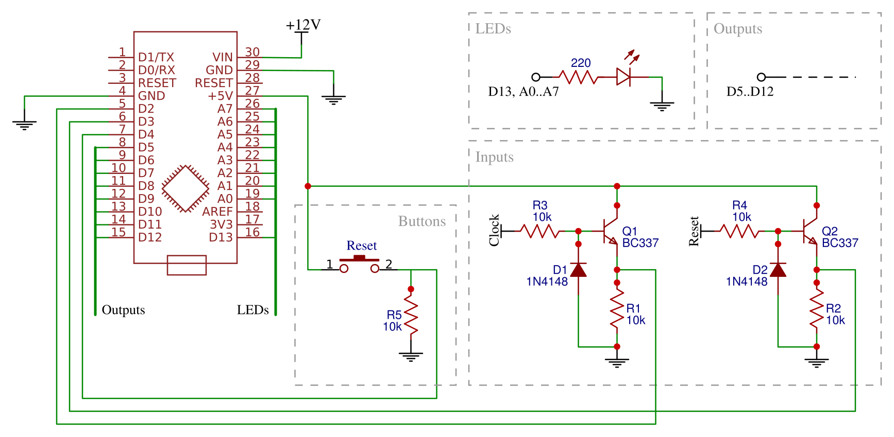

Clock divider
=============

Changes to make :
- output protection
- remove manual reset, replace with trigger/gate switch
- standalone atmega328p board

A DIY Arduino-powered clock divider in 4HP, with 3D-printed faceplate.

**[Arduino code][1]** | **[Schematics][2]** | **[Plate design][3]**

[1]: firmaware/clock-divider.ino
[2]: hardware/
[3]: cad/

Features
--------

- Divides incoming clock signal by 2, 3, 4, 5, 6, 8, 16, 32 (configurable in code).
- Reset as trigger or manual button.
- Down-beat counting.
- Trigger mode: duration of incoming pulses is preserved on outputs.
- Gate-mode: duration of the output pulses is 50% of divided tempo, enabled by long-pressing the manual reset button.

Circuit
--------

Original joeSeggiola schematic

Pictures
--------
